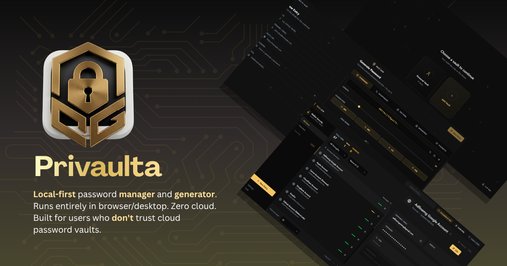

# Privaulta

Privaulta is a local-first desktop password manager and password generator. It is built for people who want to keep their vault on their own device, inspect the code that handles their secrets, and avoid accounts, cloud sync, subscriptions, telemetry, and vendor-hosted storage.

> Status: early test build. Privaulta is under active development. Try it, inspect it, and report issues, but keep a mature password manager as your primary store until this project reaches a tagged stable release.

## Why local-first?

Privaulta stores your vault in a local encrypted SQLite database on your computer. There is no hosted account, no remote vault server, and no automatic sync service. That gives you a simple trust model:

- Your passwords stay on your device.
- Your master password is not sent to a server.
- You control backups of the vault file.
- The source code is available for review, so users can check how the app stores, encrypts, unlocks, and displays their data.

The trade-off is responsibility. If you lose the device and do not have a backup, or if you forget the master password, the vault cannot be recovered.

## Open-source safety model

Security software should be inspectable. Privaulta is intended to be an open-source project so users can freely review the code and build the app themselves instead of trusting a black-box installer.

Useful places to inspect:

- `src-tauri/src/crypto.rs` - key derivation, encryption, decryption, lock state, and memory zeroing.
- `src-tauri/src/db.rs` - local SQLite schema, vault creation, entry storage, lockout tracking, and settings.
- `src/utils/secureRandom.ts` - cryptographically secure random generation helpers for passwords.
- `src/components/AutoLockHandler.tsx` - inactivity lock behavior.
- `src-tauri/tauri.conf.json` - desktop app identity, build config, and Content Security Policy.
- `DISTRIBUTION.md` - release and checksum process.

This repository is licensed under the MIT License, so users can review, use, modify, and redistribute the code under the terms in `LICENSE`.

## Features

- Multiple local vaults, each with its own master password.
- Entry storage for login title, username, website URL, password, and notes. Passwords and notes are encrypted.
- Entry search, favorites, tags, edit, and delete flows.
- Password strength label on saved entries.
- Built-in password generator with five modes:
  - Standard random passwords with length and character controls.
  - Passphrases made from random words.
  - Pattern-based passwords from templates such as `Lll-dddd-XX`.
  - Mnemonic-style generated phrases.
  - Phonetic pronounceable passwords.
- Clipboard copy with configurable auto-clear delay.
- Configurable auto-lock after inactivity.
- Brute-force throttling after repeated wrong master-password attempts.
- Legacy JSON import for older Privaulta-style exports.
- Strict desktop Content Security Policy through Tauri.

Not included yet:

- Cloud sync.
- Browser extension autofill.
- Mobile apps.
- Account recovery or master-password reset.
- Signed installers.
- Completed export, custom fields, history, or full TOTP workflows.

## How it protects your data

Privaulta uses the Rust backend for sensitive vault operations.

- Master passwords are not stored. The app derives a vault key from the password and a per-vault salt.
- Key derivation uses Argon2id with 64 MiB memory, 3 iterations, and 1 lane.
- Entry secrets are encrypted with AES-256-GCM using fresh random nonces.
- Encrypted entry fields are bound to vault, entry, and field context with additional authenticated data.
- The active vault key lives in backend memory only while the vault is unlocked.
- Locking the vault wipes the active key with `zeroize`.
- Unlock verification uses constant-time comparison for the vault sentinel.
- Repeated failed unlocks are delayed, and a hard lock is recorded after enough failures.
- Generated passwords use `crypto.getRandomValues`, not `Math.random`.

Privaulta does not protect against malware running on your machine, screen capture, keyloggers, weak master passwords, lost master passwords, or lost devices without backups.

## Install a release

Privaulta is a desktop app for Windows, macOS, and Linux.

1. Open the GitHub Releases page for this repository.
2. Download the installer for your operating system:
   - Windows: `.exe` setup or `.msi`
   - macOS: `.dmg`
   - Linux: `.AppImage`, `.deb`, or `.rpm`
3. If the release includes `SHA256SUMS.txt`, verify the downloaded file before running it.
4. Run the installer and launch Privaulta.

Example checksum commands:

```powershell
Get-FileHash '.\Privaulta_0.1.0_x64-setup.exe' -Algorithm SHA256
```

```bash
shasum -a 256 './Privaulta_0.1.0_x64-setup.exe'
```

Current builds are unsigned. Windows SmartScreen or macOS Gatekeeper may warn that the publisher cannot be verified. That warning means the binary is not code-signed; it is not proof that the app is malicious. If that makes you uncomfortable, build from source.

## Build and run from source

Building from source is the best path if you want to inspect the project and run the exact code you reviewed.

Prerequisites:

- Node.js 20 or newer.
- Rust stable toolchain from `rustup`.
- Tauri platform prerequisites for your OS: https://tauri.app/start/prerequisites/

Install dependencies:

```bash
npm install
```

Run the desktop app in development mode:

```bash
npm run tauri dev
```

Build installable desktop bundles:

```bash
npm run tauri build
```

Build output appears under:

```text
src-tauri/target/release/bundle/
```

`npm run dev` starts the Vite web UI only. Use `npm run tauri dev` when testing the real desktop app, because vault encryption and storage are provided by the Tauri backend.

## First-time use

1. Launch Privaulta.
2. Create a vault and choose a strong master password.
3. Save the master password somewhere safe. There is no recovery flow.
4. Add entries with usernames, URLs, passwords, notes, favorites, and tags.
5. Use the Generator screen or the generator panel inside entry creation to make strong passwords.
6. Copy values when needed. The clipboard is cleared after the configured delay.
7. Lock the vault manually or let auto-lock run after inactivity.

## Backups and restore

Privaulta does not sync or back up your vault automatically. Back up the local database file yourself.

The app creates `privaulta.db` in Tauri's app config directory. Typical locations are:

- Windows: `%APPDATA%\com.privaulta.desktop\privaulta.db`
- macOS: `~/Library/Application Support/com.privaulta.desktop/privaulta.db`
- Linux: `~/.config/com.privaulta.desktop/privaulta.db`

To back up:

1. Close Privaulta.
2. Copy `privaulta.db` to an external drive, encrypted cloud folder, or other backup location.
3. Keep the master password separately. The database backup is useless without it.

To restore:

1. Install Privaulta on the new device.
2. Launch it once, then close it.
3. Replace the new `privaulta.db` with your backup file.
4. Reopen Privaulta and unlock the vault with the original master password.

## Project layout

```text
privaulta/
|-- src/                 React + TypeScript UI
|   |-- components/      UI, generator, dashboard, settings, vault selector
|   |-- lib/             frontend backend wrappers, settings, importer, schemas
|   |-- pages/           routed app screens
|   `-- utils/           secure RNG, sanitizers, helpers, types
|-- src-tauri/
|   |-- src/crypto.rs    Argon2id, AES-256-GCM, key state, zeroize
|   |-- src/db.rs        SQLite schema and vault/entry commands
|   |-- src/lib.rs       Tauri command registry and plugins
|   `-- tauri.conf.json  desktop app and bundle config
|-- DISTRIBUTION.md      release build and publishing guide
`-- README.md
```

## Tech stack

- Tauri 2 desktop shell with a Rust backend.
- React 19, TypeScript, Vite, and React Router.
- Tailwind CSS and local UI components.
- SQLite through Rust `sqlx`.
- Crypto crates: `argon2`, `aes-gcm`, `zeroize`, and `subtle`.

## Development checks

Run these before publishing or opening a release:

```bash
npm run lint
npm run build
npm run tauri build
```

`npm run tauri build` takes longer because it compiles the Rust desktop backend and creates native bundles.

## Reporting issues

Open a GitHub issue for bugs, usability problems, installation trouble, or documentation gaps. For suspected security issues, contact the maintainer privately first so the fix can be prepared before details are public.

## License

Privaulta is released under the MIT License. See `LICENSE` for the full text.

